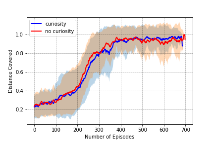

# Super Mario Bros learning with extrinsic/intrinsic rewards

This is the final project for the Reinforcement Learning course at the MVA Masters 2018/2019. 

It explores A3C and PPO algorithms and combine them with an intrinsic reward based on curiosity. 

## A3C curiosity vs no curiosity in Dense reward 

